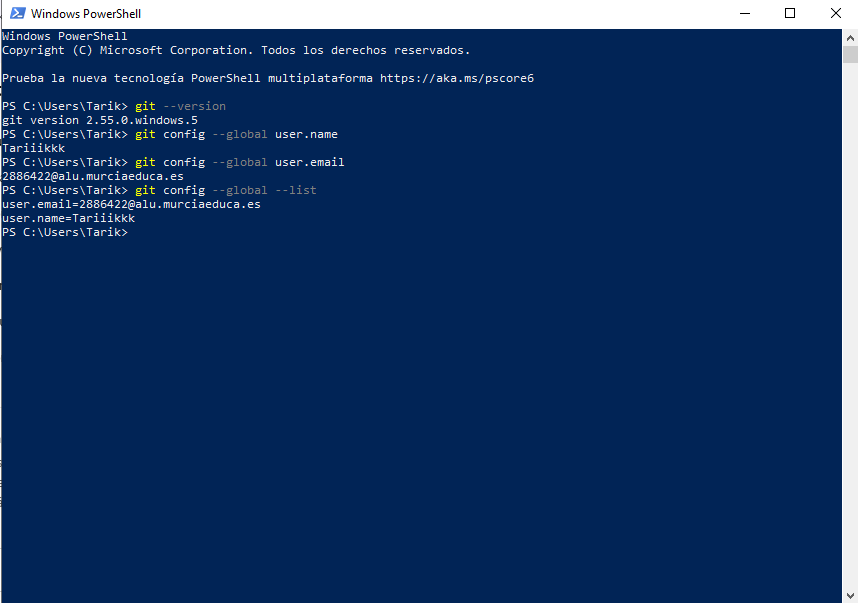

# 1. Instalación y configuración de Git

Git es un sistema de control de versiones utilizado para gestionar el código
del proyecto y realizar un seguimiento de los cambios realizados.

El control de versiones permite guardar un historial de las modificaciones
realizadas sobre los archivos del proyecto. De esta forma, es posible
consultar los cambios realizados y trabajar con diferentes versiones del
código.

En este apartado se instala Git en el equipo y se configura la identidad del
usuario que realizará los commits.

## Instalación de Git

Como el equipo parte de una instalación inicial y no dispone de Git, el
primer paso consiste en descargar e instalar la herramienta.

Git se puede descargar desde su página oficial:

https://git-scm.com/

Una vez descargado el instalador correspondiente a Windows, se ejecuta y se
siguen los pasos indicados por el asistente de instalación.

Durante la instalación se pueden mantener las opciones que aparecen por
defecto.

Una vez finalizada la instalación, se abre una nueva terminal para comprobar
que Git está disponible.

## Comprobación de Git

Para comprobar que Git se ha instalado correctamente se ejecuta:

git --version 
git config --global user.name  
git config --global user.email  
git config --global --list

## Resultado

La siguiente captura muestra la versión de Git instalada y la configuración
del usuario:

