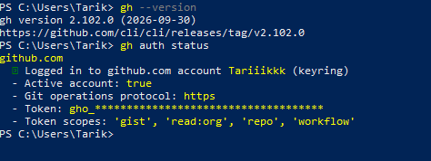

# 2. Instalación y configuración de GitHub CLI

GitHub CLI (`gh`) es una herramienta que permite interactuar con GitHub
directamente desde la línea de comandos.

En lugar de realizar determinadas operaciones exclusivamente desde el
navegador, GitHub CLI permite realizar acciones relacionadas con GitHub desde
la terminal.

En este apartado se instala GitHub CLI y se configura la autenticación con
la cuenta de GitHub que se utilizará para trabajar con el proyecto.

## Instalación de GitHub CLI

Como el equipo parte de una instalación inicial, primero es necesario
instalar GitHub CLI.

En Windows se puede utilizar el administrador de paquetes `winget`.

Desde PowerShell se ejecuta:

winget install --id GitHub.cli

## Comprobación de GitHub CLI e Inicio de Sesion

Para comprobar que GitHub CLI está instalada se ejecuta:

gh --version  
gh auth status

Y para iniciar sesion se ejecuta:

gh auth login

## Resultado

La siguiente captura muestra la versión de GitHub CLI instalada y el estado
de autenticación de la cuenta de GitHub:

