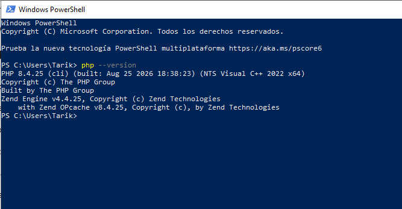

---
# 3. Instalación de Herd y PHP 8.4

Laravel Herd es un entorno de desarrollo local que permite ejecutar
aplicaciones PHP y Laravel en el propio equipo.

Herd proporciona diferentes componentes necesarios para trabajar con
aplicaciones PHP, evitando tener que configurar manualmente todos los
servicios necesarios.

En este proyecto se utiliza Herd junto con PHP 8.4.

## Instalación de Herd

Como el equipo parte de una instalación inicial, el primer paso consiste en
descargar Herd para Windows desde su página oficial:

https://herd.laravel.com/windows

Una vez descargado el instalador, se ejecuta y se siguen los pasos indicados
por el asistente.

Al finalizar la instalación se abre Herd para comprobar que el entorno está
disponible.

Herd proporciona un entorno de desarrollo que incluye componentes como PHP y
nginx, necesarios para ejecutar aplicaciones web PHP localmente.

## Comprobación de PHP

Para comprobar la versión de PHP instalada se ejecuta:

php --version

## Resultado

La siguiente captura muestra la instalación de Herd y la versión de PHP
8.4 utilizada en el proyecto:

