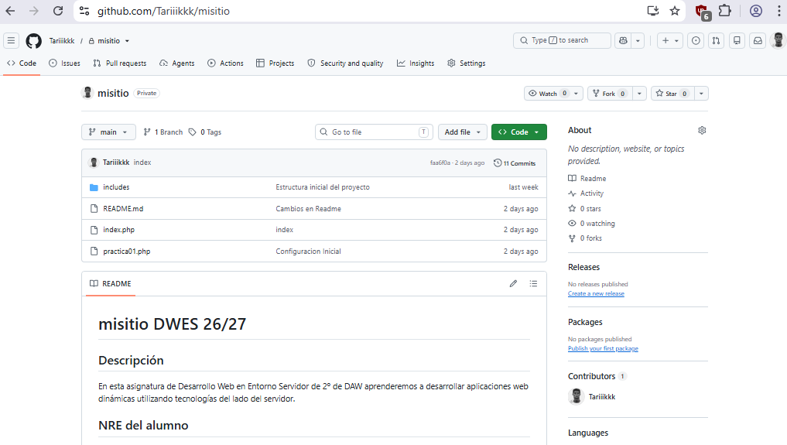

---
# 4. Repositorio misitio

En este apartado se crea y configura el repositorio correspondiente al sitio web del proyecto.

El repositorio permite almacenar el código del proyecto y realizar un seguimiento de los cambios mediante Git.

## Creación del repositorio

Se crea un repositorio denominado `misitio` en GitHub.

Una vez creado, se configura el repositorio local para trabajar con el repositorio remoto.

Para comprobar el estado del repositorio se utiliza:

git status

## Resultado

La siguiente captura muestra el repositorio `misitio` creado y los archivos
del proyecto disponibles en GitHub:

