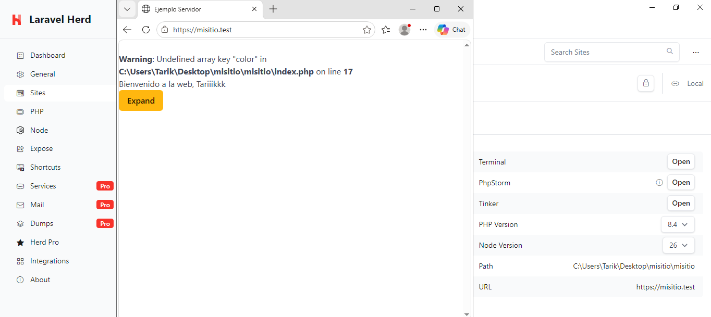

---
# 5. Herd y HTTPS

En este apartado se configura el acceso al proyecto mediante Herd utilizando HTTPS.

Herd permite asignar un dominio local al proyecto para poder acceder a él desde el navegador.

## Configuración del dominio local

Se configura el proyecto para poder acceder a él mediante un dominio local.

Una vez configurado, se comprueba que el proyecto está disponible desde el navegador.

## Configuración de HTTPS

Herd permite utilizar HTTPS en los dominios locales mediante un certificado de desarrollo.

Se activa HTTPS para el proyecto y se comprueba que el sitio puede abrirse correctamente utilizando el protocolo seguro.

La dirección utilizada para acceder al proyecto es:

https://misitio.test

## Resultado

La siguiente captura muestra el proyecto funcionando mediante Herd y
accediendo a través de una conexión HTTPS:

