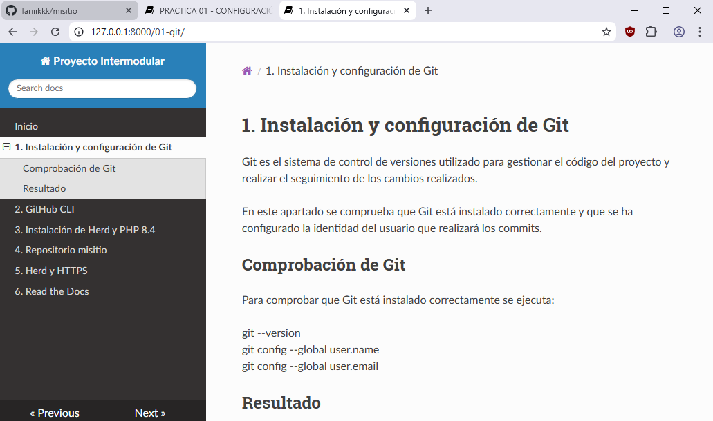

---
# 6. Read the Docs

En este apartado se configura la publicación de la documentación del proyecto mediante Read the Docs.

Read the Docs permite generar y publicar automáticamente la documentación almacenada en un repositorio.

## Configuración

En primer lugar, se utiliza el repositorio del proyecto como fuente de la documentación.

La documentación se encuentra dentro de la carpeta `docs`.

Se configura el proyecto en Read the Docs para que pueda acceder al repositorio y generar la documentación.

## Generación de la documentación

Una vez configurado el proyecto, Read the Docs obtiene los archivos del repositorio y genera la documentación.

Cada vez que se actualiza el repositorio, se puede volver a generar la documentación para mantener publicada la versión más reciente.

## Resultado

La documentación del proyecto queda publicada y accesible desde Read the Docs.

La página principal permite navegar por los diferentes apartados de la documentación:

- Instalación y configuración de Git.
- Instalación y configuración de GitHub CLI.
- Instalación de Herd y PHP 8.4.
- Repositorio misitio.
- Herd y HTTPS.

## Resultado

La siguiente captura muestra la documentación del proyecto publicada
correctamente en Read the Docs:

