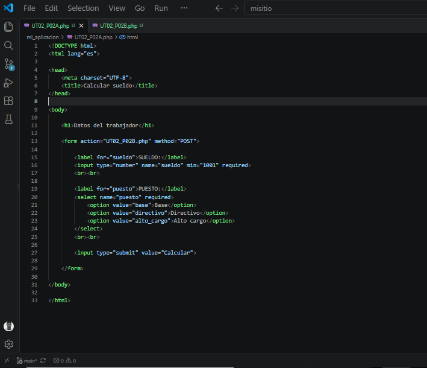
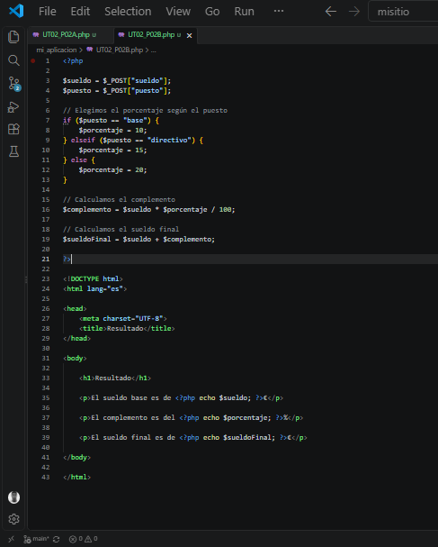
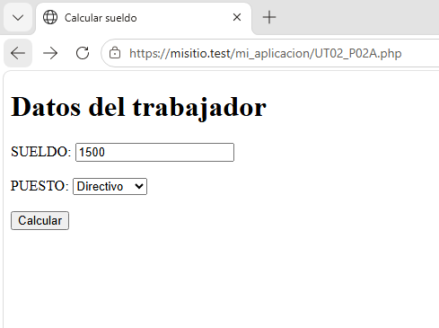
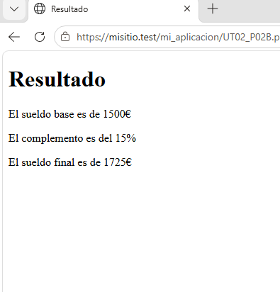

# 7. Cálculo del sueldo

En esta práctica he realizado un programa en PHP para calcular el sueldo
final de un trabajador dependiendo del puesto que ocupa.

La práctica está formada por dos archivos:

- `UT02_P02A.php`: formulario para introducir los datos.
- `UT02_P02B.php`: realiza los cálculos y muestra el resultado.

---

## 7.1. UT02_P02A.php

En este archivo he creado un formulario para introducir el sueldo del
trabajador y seleccionar su puesto.

El formulario tiene un campo para introducir el sueldo y un menú con tres
puestos: Base, Directivo y Alto cargo.

También he añadido un botón para enviar los datos al archivo
`UT02_P02B.php`.

### Captura del código

---

## 7.2. UT02_P02B.php

En este archivo recibo los datos enviados desde el formulario.

Primero recojo el sueldo y el puesto seleccionado. Después, mediante
condiciones, asigno un porcentaje dependiendo del puesto:

- Base: 10%
- Directivo: 15%
- Alto cargo: 20%

Después calculo el complemento y lo sumo al sueldo base para obtener
el sueldo final.

Finalmente, muestro el sueldo base, el porcentaje aplicado y el sueldo
final.

### Captura del código

---

## 7.3. Funcionamiento

El funcionamiento de la práctica es el siguiente:

1. Introduzco el sueldo.
2. Selecciono el puesto.
3. Pulso el botón **Calcular**.
4. Se envían los datos al segundo archivo.
5. PHP calcula el complemento.
6. Se muestra el sueldo final.

### Ejemplo

Si introduzco un sueldo de 1500 € y selecciono **Directivo**, se aplica
un 15% de complemento.

El complemento es de 225 € y el sueldo final es de 1725 €.

  

---

## 7.4. Conclusión

Con esta práctica he aprendido a utilizar formularios HTML junto con PHP,
recibir datos, utilizar condiciones y realizar operaciones matemáticas
para obtener un resultado.

